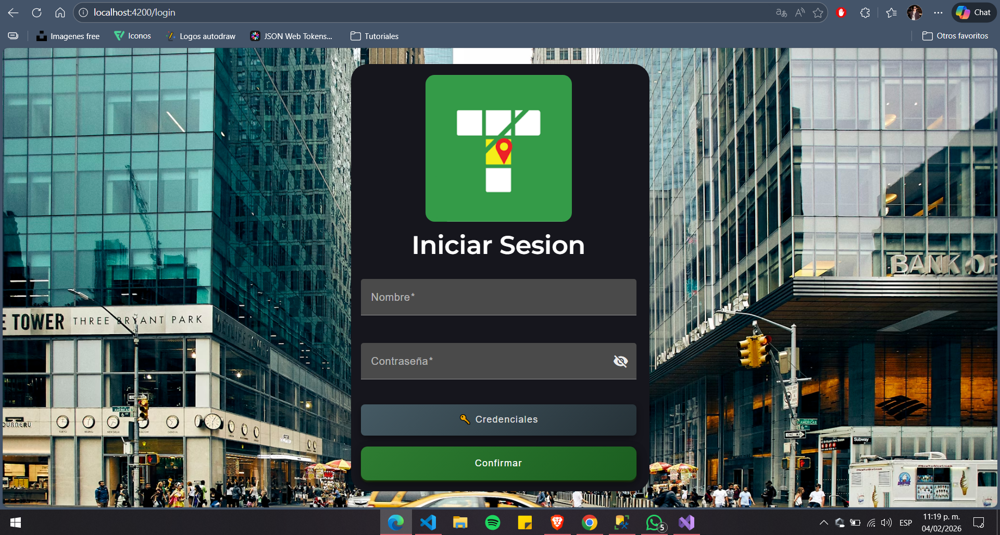
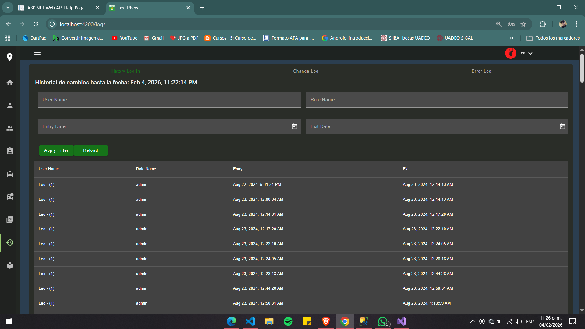
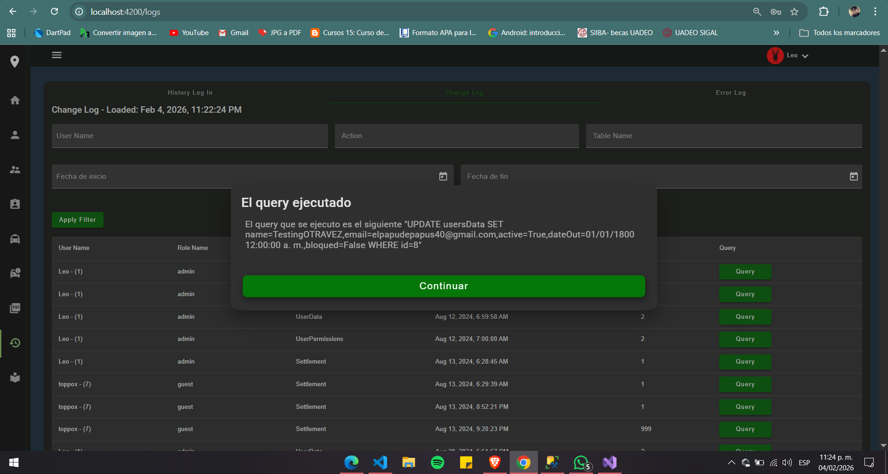
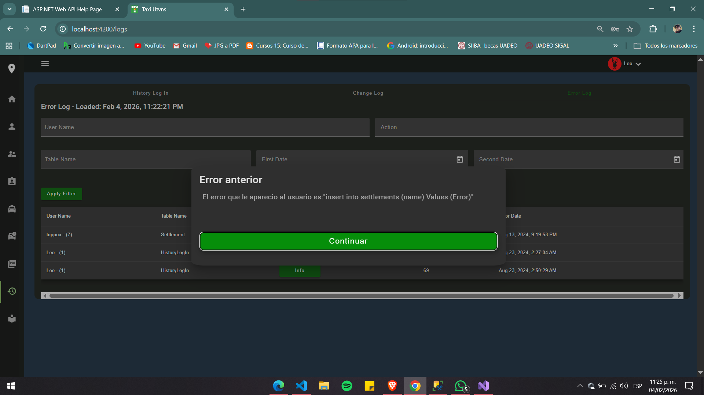

# 🚖 Taxis API (.NET Framework)

Enterprise-grade RESTful API built with .NET Framework Web API for managing taxi operations, including drivers, vehicles, accidents (sinisters), documents, permissions, and audit logs.

This API was designed following layered architecture principles, with JWT authentication, role-based authorization, and SQL Server relational modeling, ready for production and cloud deployment.

---

# 📑 Table of Contents

- [📌 System Purpose](#-system-purpose)
- [🏗️ Architecture](#-architecture)
- [🔧 Technologies](#-technologies)
- [🔐 Authentication Flow](#-authentication-flow)

- [📊 Logs Endpoint](#-logs-endpoint)
  - [GET – Login History](#-get--login-history)
  - [GET – ChangeLog History](#-get--changelog-history)
  - [GET – ErrorLog History](#-get--errorlog-history)

- [👤 USERS MODULE](#-users-module)
  - [GET – Users](#-get)
  - [POST – Create User](#-post--create-user-admin-only)
  - [❌ MISSING – GET User by Id](#-missing--get-user-by-id)
  - [❌ MISSING – PUT Update User](#-missing--put-update-user)
  - [❌ MISSING – DELETE User](#-missing--delete-user)

- [🚖 Drivers Endpoint](#-drivers-endpoint)
  - [GET – All Drivers](#-get--all-drivers)
  - [GET – Driver by Id](#-get-driver-by-id)
  - [POST – Create Driver](#-post--create-driver)
  - [PUT – Edit Driver](#-put--edit-driver)
  - [DELETE – One Driver](#-delete--one-driver)

- [📊 Dashboard Metrics](#-dashboard-metrics)
  - [GET – Drivers KPI](#-get-apihomedriverskpi)
  - [POST – Drivers Range](#-post-apihomedriversrange)
  - [GET – Sinisters KPI](#-get-apihomesinisterskpi)
  - [POST – Sinisters Range](#-post-apihomesinistersrang)

- [⚠️ Sinisters (Accidents)](#-sinisters-accidents)
  - [POST – Register Accident](#-post--register-accident)

- [🗄️ Database Structure](#-database-structure)
- [🚀 Running Locally](#-running-locally)
- [🌐 Frontend Repository](#-frontend-repository)
- [☁️ Production Deployment](#-production-deployment-enterprise-implementation)
- [🧪 Future Improvements](#-future-improvements)
- [📄 License](#-license)

# 📌 System Purpose

The system centralizes operational control for a taxi company, allowing administrators to:

• Secure authentication using JWT  
• Role-based authorization (Admin / Basic User)  
• Full CRUD operations across all modules  
• Relational SQL Server database (30+ tables)  
• File metadata management for cloud storage  
• Audit logging (Login / Error / Change tracking)  
• Dashboard statistical calculations (monthly growth metrics)  

⚠️ Repository Note  
This public repository is NOT currently deployed in Azure.  
However, the production implementation was deployed using:

• Azure App Service  
• Azure SQL Database  
• Azure Static Web Apps (Frontend)  
• Firebase Storage / Azure Blob Storage  

---

# 🏗️ Architecture

Layered architecture implementation:

```
Controllers  → HTTP handling layer
Services     → Business logic layer
Repositories → Data access abstraction
Data Layer   → SQL Server interaction
Auth Layer   → JWT security
Logs Layer   → Auditing & traceability
```
This separation ensures maintainability, scalability, and clear responsibility boundaries.

---

# 🔧 Technologies

• .NET Framework Web API  
• Entity Framework  
• SQL Server (Azure compatible)  
• ADO.NET (SqlConnection / SqlCommand)
• JWT Authentication  
• Azure Blob Storage  
• GitHub Actions (CI/CD ready)  

---

# 🔐 Authentication Flow
- JWT-based authentication
- - **Refresh Tokens**
- Role-based authorization (Admin / User / Guest)
- Secure password hashing
- Change tracking logs
- Error logging for auditing and traceability
  
## Login
Authenticates a system user and returns a JWT token along with module-level permissions.
```http
POST /api/login/enter
```

### Request Body
```json
{
  "name": "Kevin",
  "password": "HighProgrammer"
}
```

### Response
```json
{
    "IsSuccess": true,
    "ErrorMessage": null,
    "Token": "eyJhbGciOiJIUzI1NiIsInR5cCI6IkpXVCJ9.eyJuYW1laWQiOiJMZW8iLCJpZFVzZXIiOiIxIiwicm9sZSI6ImFkbWluIiwiYWN0aXZlIjoiVHJ1ZSI
    sImJsb3F1ZWQiOi..."
}
```
### JWT decoded
```json
{
  "nameid": "Kevin",
  "idUser": "7",
  "role": "admin",
  "active": "True",
  "bloqued": "False",
  "Driver": "True",
  "Admin": "True",
  "Permissionaire": "True",
  "Unit": "True",
  "Sinister": "True",
  "ExtraData": "True",
  "Logs": "True",
  "PDF": "True",
  "nbf": 17702...,
  "exp": 17702...,
  "iat": 17702...,
  "iss": "https://localhost:44319",
  "aud": "https://localhost:44319"
}

```

JWT must be included in all secured requests:

```http
Authorization Header Required:
Authorization: Bearer {token}
```

Here you can see the Login Page

---


# 📊 Logs Endpoint
These endpoints needs to be given a jwt like others but in the API is verify that the one trying to access is a administrator and not someone else

## GET – Login History
If the Administrator wants to know if someone that shouldnt access in the web page at certain hours for example when the hours to works end there shouldnt have any access.
or with this you can be sure if someone is trying strange things or even stealing the account from other user with more privilege
```http
GET /api/logs/login
```

```json
[
  {
    "username": "admin",
    "loginDate": "2026-01-15T08:30:22",
    "ipAddress": "192.168.1.10"
  }
]
```

This is the History logIn so you can know who and when entered the page
## GET – ChangeLog History
The normal endpoin that allow the administrator to see who modify certain register and specially when.
```http
GET /api/logs/changeLog
```

```json
[
{
"id": 1,
"userName": "Leo",
"idUser": 1,
"roleName": "admin",
"nameTable": "UserData",
"modDate": "2024-08-12T06:54:55.433",
"DML": 2,
"query": "UPDATE usersData SET name=TestingOTRAVEZ,email=elpapudepapus40@gmail.com,active=True,dateOut=01/01/1800 12:00:00 a. m.,bloqued=False WHERE id=8"
},
{
"id": 2,
"userName": "Leo",
"idUser": 1,
"roleName": "admin",
"nameTable": "UserPermissions",
"modDate": "2024-08-12T06:56:09.577",
"DML": 2,
"query": "UPDATE userPermissions SET idRole=3, driver=True, admin=False, permissionair=True, unit=True, sinister=True, extraData=True, changeLog=False, pdf=True WHERE idUser=8"
},...
]
```


## GET – ErrorLog History
When the Admin wants to know all the error that the web page has been having he can consult this endpoint
while the user only sees a generic error the admin can see "where,when, how and especially by who"
```http
GET /api/logs/errorLog
```

```json
[
{
"id": 1,
"userName": "toppox",
"idUser": 7,
"nameTable": "Settlement",
"MessageError": null,
"DateError": "2024-08-13T21:19:53.28",
"query": "insert into settlements (name) Values (Error)",
"DML": 999
},
{
"id": 2,
"userName": "Leo",
"idUser": 1,
"nameTable": "HistoryLogIn",
"MessageError": null,
"DateError": "2024-08-23T02:27:04.493",
"query": "update historyLogIn set exits = \"23/08/2024 02:26:52 a. m.\" where userName = \"Leo\" and exits is null",
"DML": 69
},
]
```

---

# 👤 USERS MODULE 
- User registration (admin only)
- Role management
- Secure password reset
- Permission configuration per module

Tables:
- usersData
- userPermissions
- roles

## GET 
Returns users with their assigned permissions.

```http
GET /api/users?page=1
```

```json
[
  {
    "id": 1,
    "username": "admin",
    "role": "Admin",
    "isActive": true
  }
]
```

---

## POST – Create User (Admin Only)
Only the admin will be able to do this, cause if another user wants to change his password is necessary to ask to the admin to do it, in this way all the passwords are known by the company, this was something the company ask us to do, due they are really association, becasue their business logic.
```http
POST /api/users
```

```json
{
  "name": "Leo",
  "password": "hashedPassword",
  "email": "leo@email.com",
  "roleId": 2,
  "permissions": {
    "driver": true,
    "admin": false,
    "permissionair": true,
    "unit": true,
    "sinister": false,
    "extraData": false,
    "pdf": true
  }
}
```

### Response
```json
{
  "message": "User created successfully",
  "statusCode": 201
}
```

---

# 🚖 Drivers Endpoint
- Driver registration and management
- License tracking
- Emergency contact management
- Relationship with vehicles and accident(Sinisters)
## GET- All drivers
To get all the drivers and show them in the module with all of their data, excepting the Contact from the driver, in this case could be:
- Father
  - GrandFather
- Mother
  - GrandMother
- Wife
- Son
- Brother
the system is made in a way that it can keep growing depending in what the user needs.

```http
GET /api/driver
```
```json
[
{
  "id": 1,
  "name": "Antonio",
  "lm1": "Ibarra",
  "lm2": "Mondaca",
  "birth": "2003-08-15T20:24:29.3598897-07:00",
  "hireDate": "2025-02-04T20:24:29.3598897-07:00",
  "lastModD": "2026-02-04T20:24:29.3598897-07:00",
  "password": "SashaAlejandra",
  "phone": "6683227452",
  "settlement": 10,
  "st1": 11,
  "st2": 12,
  "st3": 13,
  "contactDrivers": 14,
  "extNumber": 15,
  "admin": 16,
  "licenseEx": "2028-02-04T20:24:29.3598897-07:00",
  "ingressPay": 300,
  "status": 19,
  "statusS": "Cerritos",
  "street1": "Almeida",
  "street2": "Costarales",
  "street3": "Avenida Pasadena",
  "settlementS": "Avenida Los angeles",
  "adminName": "Humberto"
}...
]
```

---
## GET Driver by Id

To Search a specific Driver by the Id, it can be used in other modules, for example to bring a administrator that has many drivers in his relations
because its a relation **1->N**
```http
GET /api/driver?id={id}
```
```json
{
  "id": 1,
  "name": "Antonio",
  "lm1": "Ibarra",
  "lm2": "Mondaca",
  "birth": "2003-08-15T20:24:29.3598897-07:00",
  "hireDate": "2025-02-04T20:24:29.3598897-07:00",
  "lastModD": "2026-02-04T20:24:29.3598897-07:00",
  "password": "SashaAlejandra",
  "phone": "6683227452",
  "settlement": 10,
  "st1": 11,
  "st2": 12,
  "st3": 13,...
}
```

---
## POST – Create Driver
This will let us create a new driver, but in the beginning the system wont ask you for the contact driver.
The correct flow will be like this
```bash
You create a new driver --> Sent to the API (ContactDriver = 0) --> The driver has been created and send back the "id"
The user is searched by "id"--> Create a new ContactDriver --> Creates a new Contact Driver and also  'PUT' that id in the driver --> **Done**
```
```http
POST /api/driver
```

```json
Request:
{
  "id": 1,
  "name": "sample string 2",
  "lm1": "sample string 3",
  "lm2": "sample string 4",
  "birth": "2026-02-04T20:24:29.3598897-07:00",
  "hireDate": "2026-02-04T20:24:29.3598897-07:00",
  "lastModD": "2026-02-04T20:24:29.3598897-07:00",
  "password": "sample string 8",
  "phone": "sample string 9",
  "settlement": 10,
  "st1": 11,
  "st2": 12,
  "st3": 13,
  "contactDrivers": 14,
  "extNumber": 15,
  "admin": 16,
  "licenseEx": "2026-02-04T20:24:29.3598897-07:00",
  "ingressPay": 18,
  "status": 19,
  "statusS": "sample string 20",
  "street1": "sample string 21",
  "street2": "sample string 22",
  "street3": "sample string 23",
  "settlementS": "sample string 24",
  "adminName": "sample string 25"
}
```

```json
### Response
{
  "message": "Driver registered successfully",
  "statusCode": 201
}
```
---
## PUT – EDIT Driver

```http
PUT /api/driver
```
```json
Request:
{
  "id": 1,
  "name": "sample string 2",
  "lm1": "sample string 3",
  "lm2": "sample string 4",
  "birth": "2026-02-04T20:24:29.3598897-07:00",
  "hireDate": "2026-02-04T20:24:29.3598897-07:00",
  "lastModD": "2026-02-04T20:24:29.3598897-07:00",
  "password": "sample string 8",
  "phone": "sample string 9",
  "settlement": 10,
  "st1": 11,
  "st2": 12,
  "st3": 13,
  "contactDrivers": 14,
  "extNumber": 15,
  "admin": 16,
  "licenseEx": "2026-02-04T20:24:29.3598897-07:00",
  "ingressPay": 18,
  "status": 19,
  "statusS": "sample string 20",
  "street1": "sample string 21",
  "street2": "sample string 22",
  "street3": "sample string 23",
  "settlementS": "sample string 24",
  "adminName": "sample string 25"
}
```

```json
### Response
{
  "message": "Driver edited successfully",
  "statusCode": 200
}
```
## DELETE- one driver

```bash
/api/driver/{id}
```
```json
### Response
{
  "message": "Driver Deleted successfully",
  "statusCode": 200
}
```
Soft delete (status change or logical flag).

# 🚕 Units Module (Vehicles)

Vehicle management module. Handles taxi units, their status, and relationships with drivers.

## GET – Get All Units
GET /api/unit

## GET – Get Unit by Id
GET /api/unit/{id}

## POST – Create Unit
POST /api/unit

## PUT – Edit Unit
PUT /api/unit

## DELETE – Delete Unit
DELETE /api/unit/{id}


# 👑 Admin Module

## GET – Get All Admins
GET /api/admin

## GET – Get Admin by Id
GET /api/admin/{id}

## POST – Create Admin
POST /api/admin

## PUT – Edit Admin
PUT /api/admin

## DELETE – Delete Admin
DELETE /api/admin/{id}


# 🚘 Model Module

## GET – Get All Models
GET /api/model

## GET – Get Model by Id
GET /api/model/{id}

## POST – Create Model
POST /api/model

## PUT – Edit Model
PUT /api/model

## DELETE – Delete Model
DELETE /api/model/{id}


# 🏷️ Brand Module

## GET – Get All Brands
GET /api/brand

## GET – Get Brand by Id
GET /api/brand/{id}

## POST – Create Brand
POST /api/brand

## PUT – Edit Brand
PUT /api/brand

## DELETE – Delete Brand
DELETE /api/brand/{id}


# 🔐 Permission Module

## GET – Get All Permissions
GET /api/permission

## GET – Get Permission by Id
GET /api/permission/{id}

## POST – Create Permission
POST /api/permission

## PUT – Edit Permission
PUT /api/permission

## DELETE – Delete Permission
DELETE /api/permission/{id}


# 🛣️ Street Module

## GET – Get All Streets
GET /api/street

## GET – Get Street by Id
GET /api/street/{id}

## POST – Create Street
POST /api/street

## PUT – Edit Street
PUT /api/street

## DELETE – Delete Street
DELETE /api/street/{id}


# 🏘️ Settlement Module

## GET – Get All Settlements
GET /api/settlement

## GET – Get Settlement by Id
GET /api/settlement/{id}

## POST – Create Settlement
POST /api/settlement

## PUT – Edit Settlement
PUT /api/settlement

## DELETE – Delete Settlement
DELETE /api/settlement/{id}


# ☎️ ContactDriver Module

## GET – Get All Contact Drivers
GET /api/contactDriver

## GET – Get Contact Driver by Id
GET /api/contactDriver/{id}

## POST – Create Contact Driver
POST /api/contactDriver

## PUT – Edit Contact Driver
PUT /api/contactDriver

## DELETE – Delete Contact Driver
DELETE /api/contactDriver/{id}


# 📊 DataArray Module

## GET – Get All DataArrays
GET /api/dataArray

## GET – Get DataArray by Id
GET /api/dataArray/{id}

## POST – Create DataArray
POST /api/dataArray

## PUT – Edit DataArray
PUT /api/dataArray

## DELETE – Delete DataArray
DELETE /api/dataArray/{id}


# 🖼️ Image / Document Module

## GET – Get All Documents
GET /api/image

## GET – Get Document by Id
GET /api/image/{id}

## POST – Upload Document
POST /api/image

## PUT – Edit Document Metadata
PUT /api/image

## DELETE – Delete Document
DELETE /api/image/{id}


# 📊 Dashboard Metrics
Used for real-time dashboard charts in the frontend.
## GET api/home/driversKpi	
in this case we will be using this data for the KPI Cards, just quick info for the administrator and the owner of the company
```json
{
"CurrentMonth": 20,
"PreviousMonth": 10,
"Percentage": 100.0
}
```

## POST api/home/driversRange	
A range of time where the dash board will show you all the increases that the drivers had each month

```json
{
"StartDate": "2022-02-04T20:24:29.3598897-07:00",
"EndDate": "2026-02-04T20:24:29.3598897-07:00",
}
```
## GET api/home/sinistersKpi	
in this case we will be using this data for the KPI Cards, just quick info for the administrator and the owner of the company
```json
{
"CurrentMonth": 500,
"PreviousMonth": 250,
"Percentage": 100.0
}
```

## POST api/home/sinistersRange
It will bring back a ARRAY where you will have every month and the total sinisters they had that month, with this it will allow us to verify the total increase of the sinisters
and let us know wich month has more danger for the drivers.
```json
{
"StartDate": "2022-02-04T20:24:29.3598897-07:00",
"EndDate": "2026-02-04T20:24:29.3598897-07:00",
}
```


# ⚠️ Sinisters (Accidents)

## POST – Register Accident

```http
POST /api/sinisters
```

```json
{
  "driverId": 15,
  "unitId": 3,
  "description": "Rear collision",
  "insuranceId": 2,
  "date": "2026-01-14"
}
```

### Response
```json
{
  "message": "Sinister registered successfully",
  "statusCode": 201
}
```

---


# 🗄️ Database Structure

• SQL Server relational database  
• 30+ normalized tables  
• Foreign key relationships  
• Indexed for optimized queries  
• Designed for Azure SQL scalability  
• Supports 500+ active users  

---

# 🚀 Running Locally

## 1️⃣ Clone repository

```bash
git clone https://github.com/elkelvinx/ApiTaxis
```

## 2️⃣ Open solution in Visual Studio

Open `.sln` file with Visual Studio 2022+.

## 3️⃣ Configure Database Connection

Edit `web.config`:

```xml
<connectionStrings>
  <add name="DefaultConnection"
       connectionString="Server=YOUR_SERVER;
                         Database=YOUR_DATABASE;
                         User Id=YOUR_USER;
                         Password=YOUR_PASSWORD;"
       providerName="System.Data.SqlClient" />
</connectionStrings>
```

## 4️⃣ Restore NuGet Packages
From Visual Studio 
  Tools -> NugGet Package Manager -> Restore
or via conosle
```bash
Update-Package -Reinstall
```

## 5️⃣ Run Application

Press:

```
F5
```

API will run at:

```
https://localhost:44319/api/
```

---

# 🌐 Frontend Repository

Angular 17 Frontend:

https://github.com/elkelvinx/CrudTaxis

---

# ☁️ Production Deployment (Enterprise Implementation)

Production version deployed with:

• Azure App Service  
• Azure SQL Database  
• Azure Static Web Apps  
• Cloud Storage integration  
• CI/CD with GitHub Actions  

---

# 🧪 Future Improvements

• Enhanced audit system  
• Performance caching layer  
• Microservices architecture migration  
• Distributed logging integration  

---

# 📄 License

MIT
